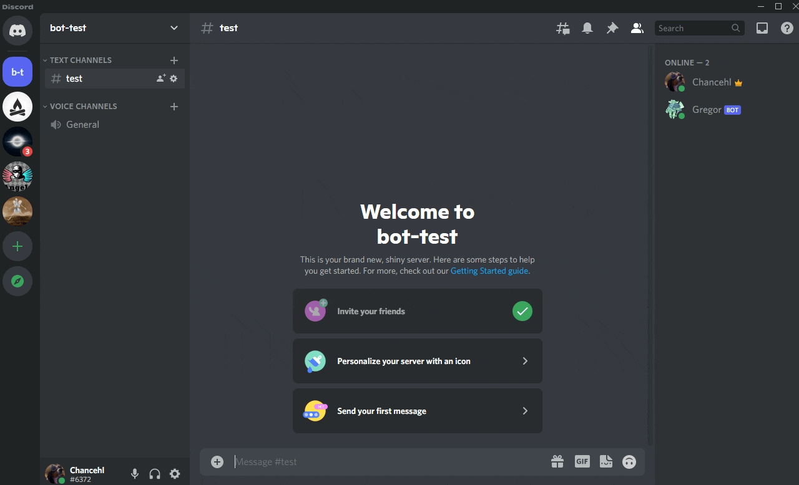
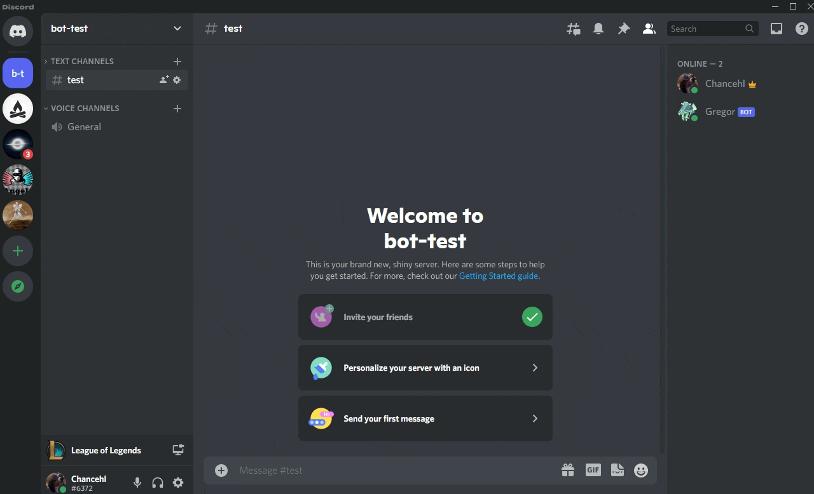
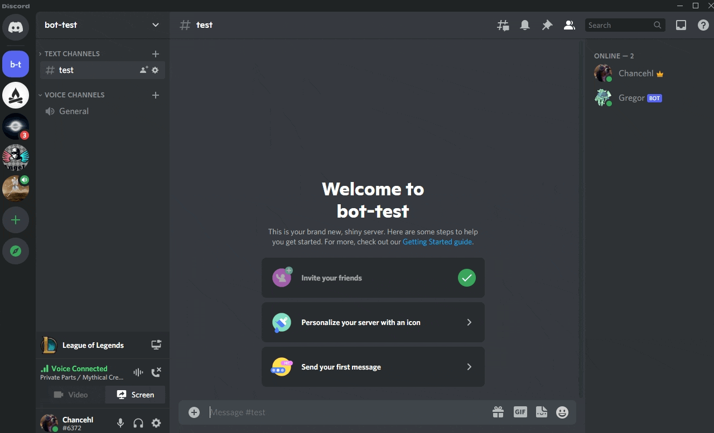

# Gregor

Gregor is a discord bot who will allow users to create squads and compete against their friends while getting records in League of Legends' "All Random, All Mid" (ARAM) game mode.

## Commands

### Create a squad

| Command         | Parameters | Example                                          | Notes                                                                                                                       |
| --------------- | ---------- | ------------------------------------------------ | --------------------------------------------------------------------------------------------------------------------------- |
| `/create-squad` | none       | `/create-squad`                                  |                                                                                                                             |
|                 | name       | `/create-squad name: The cool kids`              |                                                                                                                             |
|                 | summoners  | `/create-squad summoners: Jim, Bob, Jones`       | Comma separated                                                                                                             |
|                 | region     | `/create-squad region: NA`                       | Must be one of: NA, KR, CN                                                                                                  |
|                 | rules      | `/create-squad rules: ONLY_SNOWBALL, ONLY_SQUAD` | A comma separated list of rules that you wish you apply to your squad. The rule must be valid and exist in the table below. |

### Add a summoner to your squad

| Command         | Parameters | Example                       | Notes                                                                  |
| --------------- | ---------- | ----------------------------- | ---------------------------------------------------------------------- |
| `/add-summoner` | summoner   | `/add-summoner summoner: Bob` | Must be a valid summoner name in the region you created your squad in. |

### Remove a summoner from your squad

| Command            | Parameters | Example                       | Notes                                     |
| ------------------ | ---------- | ----------------------------- | ----------------------------------------- |
| `/remove-summoner` | summoner   | `/add-summoner summoner: Bob` | Must be a valid summoner from your squad. |

### Show your squad's records to the world

| Command  | Parameters | Example          | Notes                                           |
| -------- | ---------- | ---------------- | ----------------------------------------------- |
| `/squad` | none       | `/squad`         |                                                 |
|          | private    | `/squad private` | Only you will be able to see the records report |

## Rules

Some squads like to ensure that all members on the squad are extra equal in ARAM. When you create your squad for the first time, you are able to associate rules with your squad that determine which ARAM games can be used when determining your squad's records.

> Please note: You **cannot** modify your squad's rules after it has been created. If you want to add a rule, you'll need to delete your existing squad and create a new one using the `rules` option during squad creation.

| Name          | Flag          | Definition                                                                    | Notes |
| ------------- | ------------- | ----------------------------------------------------------------------------- | ----- |
| Only snowball | ONLY_SNOWBALL | Your records will only count if you have the snowball summoner spell equipped |       |
| Only squad    | ONLY_SQUAD    | Your records will only count if you are playing ARAM with squad members       |       |
